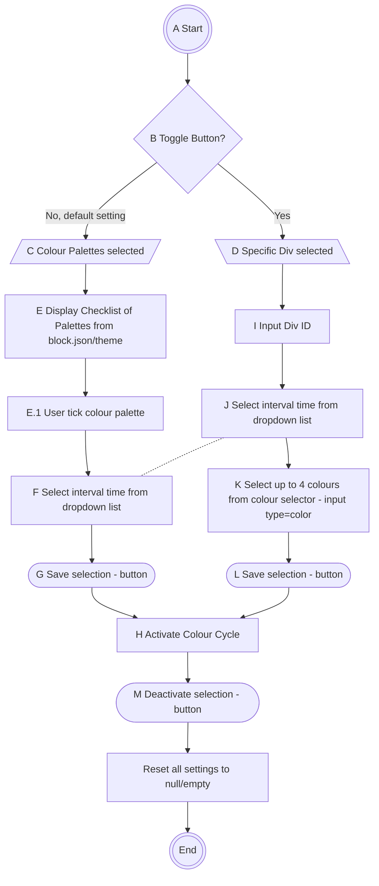

  

# Palette processing 

1. Get file paths for all .json colour palette files in parent and child themes. Return array of paths
2. Overwrite parent with child paths if duplicates. Update array
3. Check and delete duplicate file names and empty files. Update array

## Need content of files

1. 
2. Decode each .json file from each key in array of paths and write contents to array
3. 
 
## Need titles of files

1. Get file names to display in drop down list for user selection
2. For each title selected save to array
3. For each in array using current index get content data and merge with current theme file whilst removing previous data content.
4.  

## Display each palettes colour chart

1. Using array of titles and array of all contents display colours in a colour bar for each palette in drop down list.
    
# Notes for multiple div changes

## Add css to header as inline style using wp_add_inline_style()

This takes the css as a one line string arg but must enqueue first

## Pseudo plain english

### User input
Select div name class or id ( use if # to identify id and else for class.) - save as string

Select style ie background-colour - save as string

Select colours from colour picker (min2-max4) - save as array

Select interval time - save as integer and cron event to schedule runtime

### Processing logic
Save variables to key value array with title of each as class name

If more than 1 style is required for the same class then these are saved as array with title as style name

    div array
    [
        'wp-block-post-title': [
            'background-color': [
                'style_value': { $current_colour },
                'interval': { $interval }      
            ],
            'font': [
                'style_value': { $style_to_change },
                'interval': { $nterval }
            ]
        ],
        [
        'wpadminbar': [
            'background-color': [
                'style_value': { $current_colour },
                'interval': { $interval }
            ]
        ]
    ]

Use wp add_option(cycle_colours_css_classes, []) to save to database
Use wp get_option(cycle_colours_css_classes) to retrieve and use/amend
Use wp update_option(cycle_colours_css_classes) to save new settings

Use get_option for each var and array to store user inputs.

$class = get_option(cycle_colours_class, '')

$style = get_option(cycle_colours_style, '')

$colours = get_option(cycle_colours_colours, [])

$current_colour = get_option(current_colour, '')

$current_colour_index = (int) get_option(cycle_colours_current_colour_index, 0)

$divs = get_option(cycle_colours_divs, []) -- array of objects

Get current_colour from colour array using index + 1 and update_option(cycle_colours_current_colour_index)

Pass all as args for: 

Update div array

    function to check and update div array 
    
    if !empty(divs) //if array is empty
        foreach class  
            if(class == $class) is present,
                foreach style, 
                    if true edit value and interval,                 
            else add in vars for new class, style, current_colour, interval 
            update_option(cycle_colours_divs)
    reset $class, style to empty

    Note: need to add interval and colour array, current colour and colour index
    Not big enough yet for OOP refactor but needs all data in single flat assoc array. 

Create inline css string 

    function to make css string from div array and return string

In add action for div task, 

    WP_register_styles(cycle_colours_frontend_inline, false) and 
    wp_enqueue_styles(cycle_colours_frontend_inline) 
        call create/update div array
        $inline_css = call make inline css
    wp_add_inline_style(cycle_colours_frontend_inline, $inline_css)

These will have to be run on each schedule event and a new inline css created even if no changes are made.
Could include boolean check for div array update, if no new data then skip and create inline css. Maybe on save change a boolean to true with default false.
Could reset the object vals to default at the end of a div array update and a simple if(!empty($class) and !empty($style)) run div array update

Delete an entry from div array

    To delete an entry user just enters class for all class, or class and  style for style only, no colour selection, and hit delete. Add a check if vals in colour then return message saying it is aborted. Include note in admin frontend for this next to a delete button.   
    Add a check in the update div array function, if no colour vals then delete style, if no style then delete class (all), if colour vals return false ond echo aborted error message. 